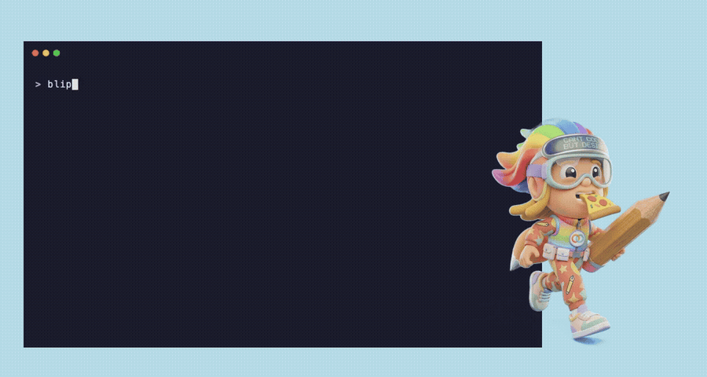

<p align="center">
  
</p>

<p align="center">
  <strong>Stop describing UI changes. Start drawing them.</strong><br>
  Visual annotation MCP server for <a href="https://claude.com/claude-code">Claude Code</a>.
</p>

<p align="center">
  <a href="https://www.npmjs.com/package/blip-mcp"></a>
  <a href="https://github.com/nebenzu/Blip/blob/main/LICENSE"></a>
  <a href="https://www.npmjs.com/package/blip-mcp"></a>
</p>

<p align="center">
  
</p>

---

## What it does

Blip adds a drawing overlay to any web page you're working on. Circle what needs changing, add arrows, highlight sections, write text labels -- then send the annotated screenshot straight back to Claude. Claude sees exactly what you mean and updates the code.

## Install

```bash
claude mcp add blip -- npx blip-mcp
```

That's it. Requires [Claude Code](https://claude.com/claude-code) and Node.js 18+.

## Usage

Just tell Claude **"blip"** during any conversation:

```
You:    blip

        ⏺ blip - annotate (MCP)
          Opening browser with overlay on http://localhost:3000...
          Waiting for annotation...

          ⏺ [Annotated screenshot received]

          The user has annotated a screenshot with visual feedback.
          - RED circles/rectangles = elements that need changes
          - ARROWS = point to specific areas or show movement
          - TEXT labels = direct instructions

Claude: I can see your annotations. Let me make those changes:

        1. Moving the search bar to the header (circled area)
        2. Swapping the two cards (arrow indication)
        3. Making the sidebar collapsible (highlighted region)
```

You can also pass a URL directly: **"blip http://localhost:3000"**

## Drawing tools

- **Pen** -- freehand drawing
- **Arrow** -- point to elements or show direction
- **Circle** -- highlight specific elements
- **Rectangle** -- mark regions
- **Highlight** -- semi-transparent marker
- **Text** -- add labels and instructions

## How it works

1. Blip runs as an MCP server alongside Claude Code
2. When invoked, it opens your page in a browser with a drawing overlay injected
3. You draw annotations directly on the live page
4. Click "Send to Claude" -- the screenshot (page + annotations) returns to your chat
5. Claude interprets the visual feedback and implements the changes

## Development

```bash
git clone https://github.com/nebenzu/Blip.git
cd Blip && npm install && npm run build
```

```bash
npm run dev     # Watch mode
npm run serve   # Dev server on port 4460
npm start       # Run MCP server directly
```

## License

MIT
